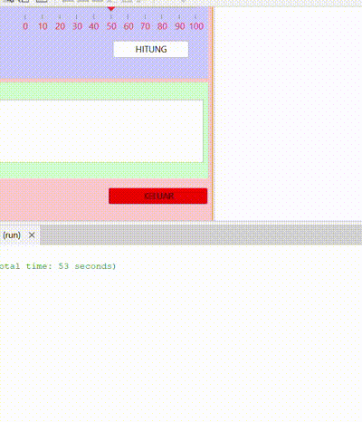

# AplikasiPenghitungDiskon
 Siti Aisyah Nor Fitriani - 2210010043 - Tugas 3

## Deskripsi Aplikasi
Aplikasi Penghitung Diskon ini adalah aplikasi desktop sederhana untuk menghitung potongan harga dengan diskon tambahan berdasarkan kupon dan pilihan diskon dari slider atau combobox. Aplikasi ini memudahkan pengguna dalam menghitung harga akhir setelah diskon diterapkan, baik melalui kupon maupun diskon tambahan.

## Fitur Utama
- **Validasi Kupon Diskon**: Mendukung kupon seperti `DISKON10`, `DISKON20`, `DISKON50` untuk memberikan diskon berdasarkan kode yang dimasukkan.
- **Diskon Tambahan**: Pengguna dapat memilih diskon tambahan melalui `JComboBox` atau `JSlider`.
- **Perhitungan Harga Akhir**: Menghitung potongan harga berdasarkan total diskon yang diterapkan (kombinasi dari kupon dan diskon tambahan).
- **Riwayat Diskon**: Menyimpan dan menampilkan riwayat transaksi diskon dalam `JTextArea`.
- **Tombol Hapus**: Menghapus semua input pengguna dan mengosongkan riwayat diskon.
- **Tombol Keluar**: Menyediakan dialog konfirmasi untuk keluar dari aplikasi.

## Cara Menggunakan Aplikasi
1. **Masukkan Harga Asli**:
   - Masukkan harga asli produk pada kolom **Masukkan Harga Asli**.

2. **Masukkan Kupon Diskon**:
   - Jika memiliki kode kupon (misalnya `DISKON10`, `DISKON20`, `DISKON50`), masukkan di kolom **Masukkan Kupon Diskon**.
   - Jika kode kupon valid, diskon kupon akan diterapkan.

3. **Pilih Diskon Tambahan**:
   - Pilih diskon tambahan melalui dropdown (`JComboBox`) atau gunakan slider (`JSlider`) untuk menambahkan diskon ekstra.

4. **Hitung Harga Akhir**:
   - Klik tombol **HITUNG** untuk menghitung potongan harga dan harga akhir setelah diskon.
   - Hasil perhitungan akan ditampilkan di bawah tombol, dan riwayat transaksi akan dicatat di area **Riwayat Diskon Anda**.

5. **Hapus Input**:
   - Klik tombol **HAPUS** untuk menghapus semua input dan mengosongkan riwayat diskon.

6. **Keluar dari Aplikasi**:
   - Klik tombol **KELUAR** untuk menutup aplikasi. Akan muncul dialog konfirmasi untuk memastikan apakah pengguna ingin keluar dari aplikasi.

## Pembuat Aplikasi
**Siti Aisyah Nor Fitriani**
**2210010043**

## Demo

## Catatan
- Hanya masukkan angka pada kolom **Harga Asli** untuk menghindari kesalahan input.

